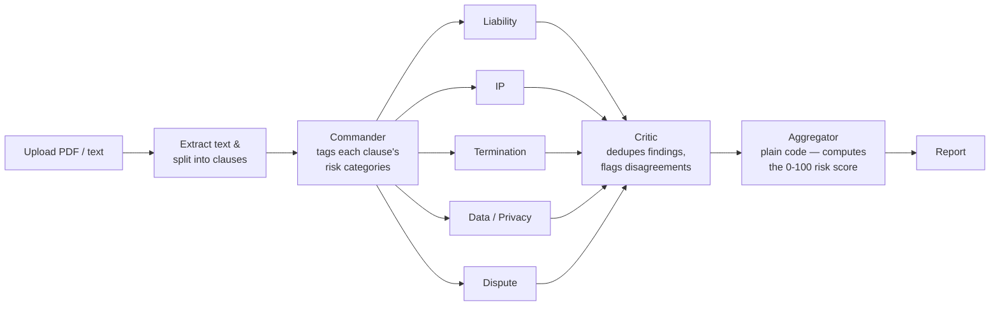

# ContractCommander

ContractCommander is a multi-agent contract risk analyzer. Upload a contract
(PDF or plain text) and a pipeline of Claude-powered agents reads it clause
by clause: a **Commander** agent tags each clause with the risk categories
it touches, five **specialist agents** — Liability, IP, Termination,
Data/Privacy, and Dispute — each review only their own area, a **Critic**
agent cross-checks all five agents' findings for duplicates and
disagreements, and a plain-code **Aggregator** turns the result into a
0–100 risk score and a grouped report (🔴 High Risk / 🟠 Review / 🟢 Low
Concern).

Built for the AO hackathon.

## Live demo

**Live demo:** _[coming soon — deploying tomorrow, link will go here]_

## Architecture



In short: **Commander → 5 specialist agents → Critic → Aggregator →
Report.** The five specialist agents are called as sequential LLM calls
today (not literal parallel processes) — see
[`server/src/agents/index.ts`](server/src/agents/index.ts).

## Structure

```
.
├── client/             React + TypeScript frontend (Vite)
├── server/             Node.js + Express + TypeScript backend (Prisma + PostgreSQL)
│   └── Dockerfile      production image for the server (see "Running locally with Docker" below)
├── render.yaml         Render Blueprint for deployment
└── sample-contracts/   test fixtures for the upload flow
```

### Client (`/client`)

- Vite + React + TypeScript, routed with `react-router-dom`
- `src/pages` — the landing/upload page and the report page
- `src/components` — reusable UI (upload zone, finding cards, risk badge, etc.)
- `src/lib` — shared client-side utilities (API client, types, risk helpers)

### Server (`/server`)

- Express + TypeScript, Prisma models `Contract`, `Clause`, `RiskFinding`
- `GET /health` — returns `{ status: "ok" }`
- `POST /api/contracts/upload` — accepts a PDF or text file (multipart field
  `file`), extracts text (`pdf-parse` for PDFs), splits it into clauses by
  heading/paragraph structure, persists `Contract` + `Clause` rows, then runs
  the analysis pipeline and persists `RiskFinding` rows.
- `GET /api/contracts/:id/report` — returns
  `{ riskScore, categoryCounts, findings }` for a previously analyzed
  contract.
- `src/agents/` — the commander, five category sub-agents, and critic:
  prompts live in `src/agents/prompts/`, structured JSON output is enforced
  via Zod schemas (`client.messages.parse` + `zodOutputFormat`).
- `src/services/aggregator.ts` — plain code (no LLM call) that computes the
  risk score and buckets findings into 🔴 High Risk / 🟠 Review / 🟢 Low
  Concern groups.

## Running locally with Docker (recommended)

> **Note:** a `docker-compose.yml` that starts the client, server, and a
> database together with one command isn't in this repo yet — that's
> planned but not done. In the meantime, `server/Dockerfile` is a real,
> tested production image for the backend; the steps below use it directly.
> You'll still need Node.js locally for the frontend (see the "without
> Docker" section below for that piece) until compose support lands.

**Prerequisites:** Docker, and a PostgreSQL database (e.g. a free
[Neon](https://neon.tech) instance — this is what `render.yaml` in this repo
is configured to use in production).

1. Clone the repo and set up the server's environment file:

   ```bash
   git clone <this-repo-url>
   cd contractcommander
   cp server/.env.example server/.env
   ```

   Edit `server/.env` and set `DATABASE_URL` to your Postgres connection
   string and `ANTHROPIC_API_KEY` to a valid Anthropic API key.

2. Apply the database schema (needs Node.js/npm locally for this one-time
   step — Prisma CLI isn't bundled into the runtime image):

   ```bash
   npm install
   npx --workspace server prisma migrate deploy
   ```

3. Build and run the server image from the **repo root** (the build needs
   the whole npm-workspaces context, not just `server/` — see the comment
   at the top of `server/Dockerfile`):

   ```bash
   docker build -f server/Dockerfile -t contractcommander-server .
   docker run --env-file server/.env -p 4000:4000 contractcommander-server
   ```

4. Confirm it's up:

   ```bash
   curl http://localhost:4000/health
   # {"status":"ok"}
   ```

5. Start the frontend (not yet dockerized — see below), pointed at this
   server:

   ```bash
   cp client/.env.example client/.env   # already defaults to http://localhost:4000
   npm run dev:client
   ```

   Open **http://localhost:5173**.

## Running locally without Docker

1. Install dependencies from the repo root (this installs both workspaces):

   ```bash
   npm install
   ```

2. Configure environment variables:

   ```bash
   cp server/.env.example server/.env
   cp client/.env.example client/.env
   ```

   Edit `server/.env` and set `DATABASE_URL` to point at your PostgreSQL
   instance, and `ANTHROPIC_API_KEY` to a valid Anthropic API key.

3. Generate the Prisma client and apply the database schema:

   ```bash
   npm run prisma:generate --workspace server
   npx --workspace server prisma migrate deploy
   ```

4. Run both the client and server together:

   ```bash
   npm run dev
   ```

   Or run them individually:

   ```bash
   npm run dev:client   # Vite dev server — http://localhost:5173
   npm run dev:server   # Express server with hot reload — http://localhost:4000
   ```

## Sample contracts

[`sample-contracts/`](sample-contracts/) has four ready-to-upload test
fixtures spanning a range of risk levels, useful for exercising the upload
flow without needing your own contract on hand:

| File | Risk level |
|---|---|
| `01-high-risk-service-agreement.txt` | High |
| `02-low-risk-mutual-nda.txt` | Low |
| `03-medium-risk-freelance-agreement.txt` | Medium |
| `04-long-enterprise-agreement.txt` | Long-form (18 numbered sections) |

## Build

```bash
npm run build
```

## Type checking

```bash
npm run typecheck
```

## Tech stack

- **Backend:** Node.js, Express, TypeScript, Prisma ORM, PostgreSQL
- **Frontend:** React, TypeScript, Vite, React Router
- **AI:** Claude (Anthropic API) — `client.messages.parse` with Zod-enforced
  structured output for every agent in the pipeline
- **Deployment:** Docker (`server/Dockerfile`), Render (`render.yaml`)
