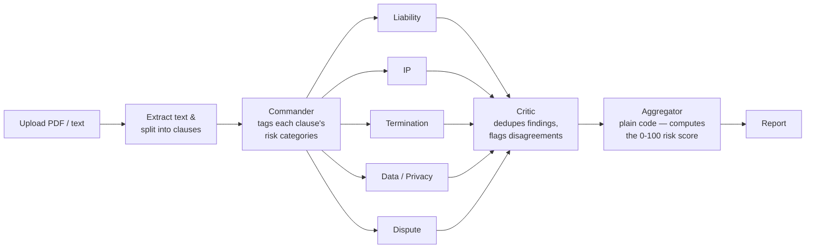
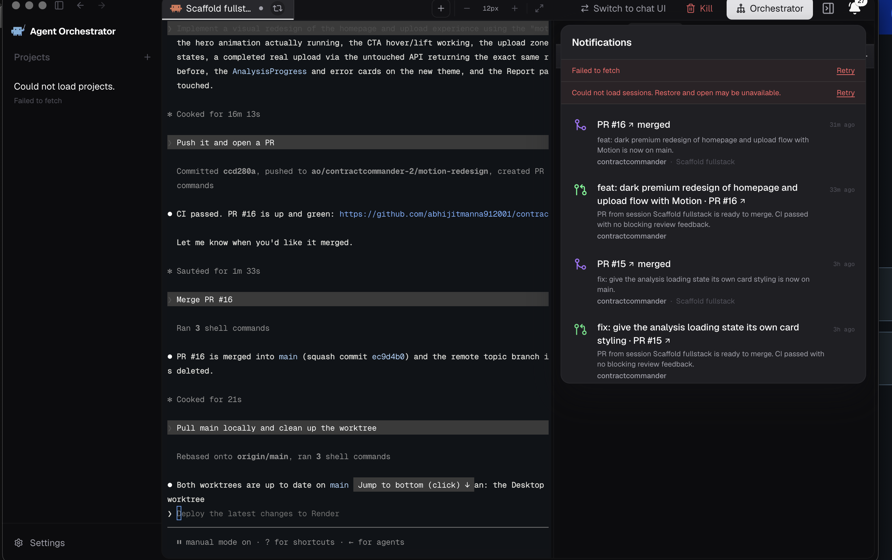

# ⚖️ ContractCommander

**A multi-agent AI system that reads your contract the way a legal team would — just faster.**

Upload a contract and a pipeline of specialist Claude agents reads it clause by clause: a **Commander** agent tags what each clause touches, five **specialist agents** independently review Liability, IP, Termination, Data Privacy, and Dispute Resolution, a **Critic** agent cross-checks their findings for duplicates and disagreements, and a deterministic aggregator turns it all into one clear 0–100 risk score. No forty-page memo. No legalese. Just what's risky, why, and what to do about it.

<p>
  <a href="https://contractcommander.onrender.com"></a>
  <a href="https://contractcommanderx.onrender.com/health"></a>
</p>

---

## 🔗 Live Links

| | |
|---|---|
| **Live demo** | [contractcommander.onrender.com](https://contractcommander.onrender.com) |
| **Demo video** | [loom.com/share/d7a9edd8b613419babb963942b964d03](https://www.loom.com/share/d7a9edd8b613419babb963942b964d03) |
| **Backend API** | [contractcommanderx.onrender.com/health](https://contractcommanderx.onrender.com/health) — this is just the health check endpoint, not a UI; the demo link above is the actual app |

> Both services run on Render's free tier, so the first request after a period of inactivity can take ~30–60s to spin back up. Give it a moment.

---

## 🧠 Architecture



**Commander → 5 specialist agents → Critic → Aggregator → Report.** The five specialists are called as sequential LLM calls today, not literal parallel processes — see [`server/src/agents/index.ts`](server/src/agents/index.ts). The Aggregator is plain code, not an LLM call: it's a deterministic scoring function over the Critic's output.

---

## ✨ What Makes This Different

- **Evidence-backed, not vibes-based.** Every finding cites the exact clause it's flagging — no vague "this contract seems risky" summaries.
- **Self-destructing reports.** Privacy by design: your contract is analyzed, the report is shown to you once, and then it's gone. Nothing is retained after that single view — see [`server/src/routes/contracts.ts`](server/src/routes/contracts.ts).
- **Retry-resilient.** API calls to Claude automatically retry with backoff on rate limits (429) or upstream overload (529), so a busy moment on Anthropic's side doesn't sink your analysis — see [`server/src/services/llmClient.ts`](server/src/services/llmClient.ts).
- **A real critic, not just five independent opinions.** The Critic agent cross-checks all five specialists' findings, dedupes overlapping flags, and surfaces disagreements between agents instead of silently picking one.

---

## 🚀 Running Locally

### Option A: Docker (recommended for the backend)

> A single `docker-compose.yml` that starts the client, server, and a database together isn't in this repo yet. `server/Dockerfile` is a real, production-tested image for the backend, though — the steps below use it directly. You'll still need Node.js locally for the frontend piece (see Option B for that half).

**Prerequisites:** Docker, and a PostgreSQL database (e.g. a free [Neon](https://neon.tech) instance — this is what `render.yaml` uses in production).

1. Clone the repo and set up the server's environment file:

   ```bash
   git clone https://github.com/abhijitmanna912001/contractcommander.git
   cd contractcommander
   cp server/.env.example server/.env
   ```

   Edit `server/.env` and set `DATABASE_URL` to your Postgres connection string and `ANTHROPIC_API_KEY` to a valid Anthropic API key.

2. Apply the database schema (needs Node.js/npm locally for this one-time step — the Prisma CLI isn't bundled into the runtime image):

   ```bash
   npm install
   cd server && npx prisma migrate deploy
   ```

3. Build and run the server image from the **repo root** (the build needs the whole npm-workspaces context, not just `server/` — see the comment at the top of `server/Dockerfile`):

   ```bash
   docker build -f server/Dockerfile -t contractcommander-server .
   docker run --env-file server/.env -p 4000:4000 contractcommander-server
   ```

4. Confirm it's up:

   ```bash
   curl http://localhost:4000/health
   # {"status":"ok"}
   ```

5. Start the frontend (not yet dockerized), pointed at this server:

   ```bash
   cp client/.env.example client/.env   # already defaults to http://localhost:4000
   npm run dev:client
   ```

   Open **http://localhost:5173**.

### Option B: Without Docker

1. Install dependencies from the repo root (installs both workspaces):

   ```bash
   npm install
   ```

2. Configure environment variables:

   ```bash
   cp server/.env.example server/.env
   cp client/.env.example client/.env
   ```

   Edit `server/.env` and set `DATABASE_URL` to point at your PostgreSQL instance, and `ANTHROPIC_API_KEY` to a valid Anthropic API key.

3. Generate the Prisma client and apply the database schema:

   ```bash
   npm run prisma:generate --workspace server
   cd server && npx prisma migrate deploy
   ```

4. Run both the client and server together from the repo root:

   ```bash
   npm run dev
   ```

   Or run them individually:

   ```bash
   npm run dev:client   # Vite dev server — http://localhost:5173
   npm run dev:server   # Express server with hot reload — http://localhost:4000
   ```

### Build & type-check

```bash
npm run build      # builds both workspaces
npm run typecheck  # type-checks both workspaces
```

---

## 📄 Sample Contracts

Don't have a contract handy? [`sample-contracts/`](sample-contracts/) has four ready-to-upload fixtures spanning a range of risk levels:

| File | Risk level | Notes |
|---|---|---|
| `01-high-risk-service-agreement.txt` | 🔴 High | Uncapped liability, one-sided terms |
| `02-low-risk-mutual-nda.txt` | 🟢 Low | Balanced, standard mutual NDA |
| `03-medium-risk-freelance-agreement.txt` | 🟠 Medium | A mix of fair and lopsided clauses |
| `04-long-enterprise-agreement.txt` | — | Long-form, 18 numbered sections — good for stress-testing clause splitting |

---

## 🛠️ Tech Stack

- **Backend:** Node.js, Express, TypeScript, Prisma ORM, PostgreSQL ([Neon](https://neon.tech))
- **Frontend:** React, TypeScript, Vite, React Router, [Motion](https://motion.dev)
- **AI:** [Claude](https://www.anthropic.com/claude) via the Anthropic TypeScript SDK — `messages.parse` with Zod-enforced structured output for every agent in the pipeline
- **Deployment:** Docker (`server/Dockerfile`), [Render](https://render.com) (`render.yaml`)

---

## 🤖 Built with AO

ContractCommander was built end-to-end using **Agent Orchestrator (AO)** during **The Orchestra** hackathon (August 12–13, 2026) — from initial scaffold through the full agent pipeline, frontend, deployment configuration, and this README.


_AO's task board, showing the task and PR history from building ContractCommander._


_AO's browser tool being used to verify the live deployment after shipping._

---

## ⚠️ Disclaimer

ContractCommander provides informational analysis, not legal advice. It's a tool to help you spot what's worth a closer look — always consult a qualified attorney before making decisions about a real contract.
